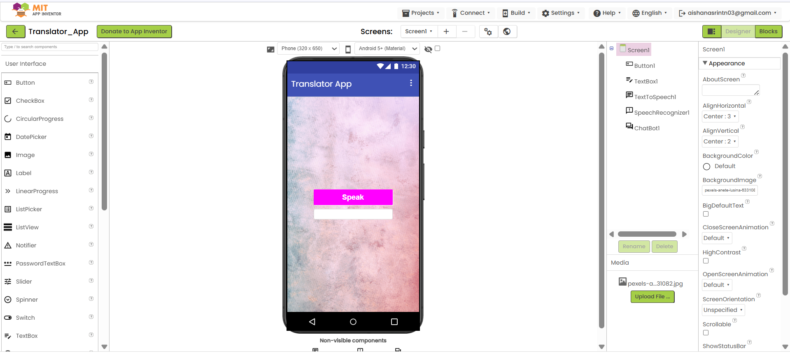

# Translator App (MIT App Inventor)

A simple voice-based translator application developed using **MIT App Inventor**.

## Description

This application consists of a single screen with a **Speak** button and a **TextBox** for entering the target language.  
The user types the language to translate into, clicks the **Speak** button, and speaks a word or sentence.  
The app translates the spoken input into the specified language using a chatbot-based translation tool and plays the translated output using Text-to-Speech.

## Features

- Single screen user interface  
- Voice input using Speech Recognizer  
- Language selection through text input  
- Translation using chatbot tool  
- Audio output using Text-to-Speech  

## Built With

- MIT App Inventor  
- Speech Recognizer  
- Text to Speech  
- Chatbot Tool  

## Components Used

- Button  
- TextBox  
- Speech Recognizer  
- TextToSpeech  
- Chatbot / AI Translation Component  

## How to Use

1. Enter the target language in the TextBox  
2. Click the **Speak** button  
3. Speak the word or sentence  
4. The app translates and speaks the output

## Screenshots

### App Interface

### Block Code

## Installation

1. Open MIT App Inventor  
2. Import the `.aia` project file  
3. Connect an Android device or emulator  
4. Run the application  

## Future Improvements

- Dropdown for language selection  
- Display translated text on screen  
- Support for multiple translations  
- Improved translation accuracy  

## Author

Aisha Nasrin TN

## License

This project is for educational purposes.
